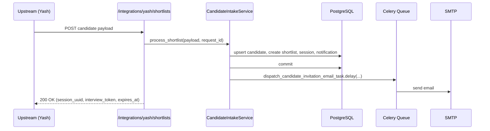
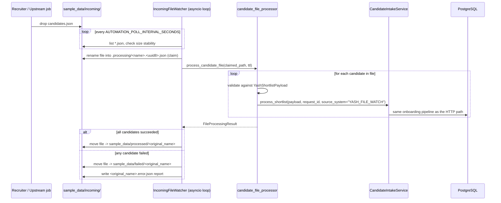
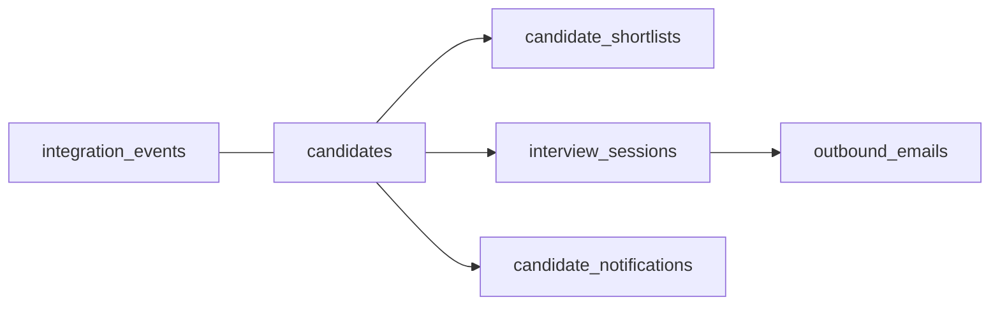
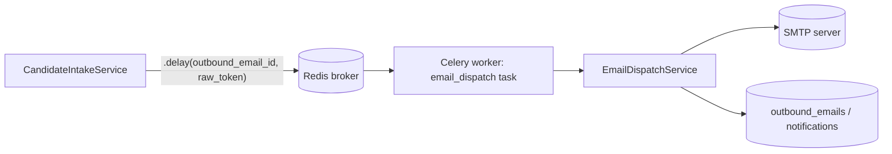
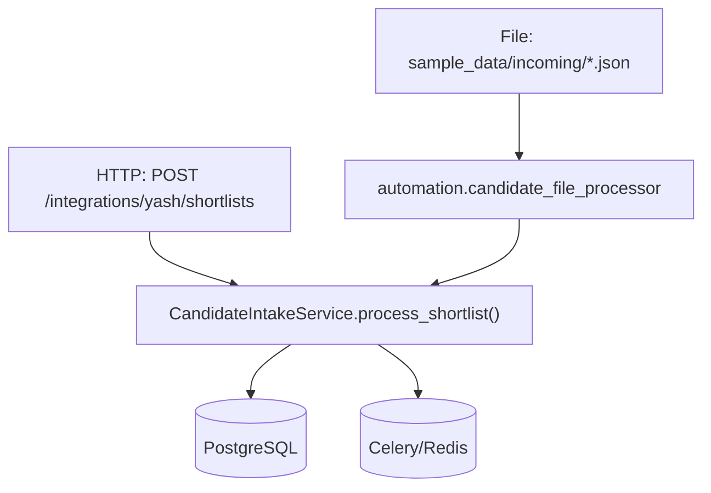

# architecture.md — Technical Architecture

> Update this file whenever architecture changes — new modules, changed
> flows, new dependencies. It should always match the code as it exists
> right now.

## 1. Folder Structure

```
SAAS Model/
├── app/
│   ├── main.py                  # FastAPI app + lifespan (starts Automation Service)
│   ├── api/v1/
│   │   ├── routers/             # health, integrations, interview, dashboard, demo
│   │   └── schemas/             # pydantic request/response models
│   ├── core/                    # config, constants, errors, logging, security
│   ├── db/
│   │   ├── models/               # SQLAlchemy ORM models
│   │   ├── repositories/         # DB access per aggregate
│   │   ├── base.py / session.py
│   ├── integrations/             # smtp_client.py
│   ├── middleware/                # request_context.py
│   ├── services/
│   │   ├── candidate_intake_service.py   # core onboarding pipeline
│   │   ├── dashboard_service.py
│   │   ├── email_dispatch_service.py
│   │   ├── interview_access_service.py
│   │   ├── onboarding/            # session/email builders
│   │   ├── resume/                # resume parsing (pdf/docx)
│   │   └── automation/            # NEW: self-running file-intake watcher
│   │       ├── candidate_file_processor.py
│   │       └── file_watcher_service.py
│   └── workers/
│       ├── celery_app.py
│       └── tasks/email_dispatch.py
├── sample_data/
│   ├── candidates.json            # sample payload (manual testing)
│   ├── incoming/                  # NEW: drop candidate JSON files here
│   ├── processed/                 # NEW: fully-successful files land here
│   └── failed/                    # NEW: failed files + <file>.error.json reports
├── scripts/send_candidates.py     # legacy manual HTTP-posting utility
├── tests/
│   ├── unit/ (phase4, phase5, phase7, ...)
│   ├── integration/
│   └── contract/
├── alembic/                        # DB migrations
└── frontend/                       # React dashboard
```

## 2. Module Responsibilities

| Module | Responsibility |
|---|---|
| `api/v1/routers/integrations.py` | HTTP entry point for shortlisted candidates (`POST /integrations/yash/shortlists`) |
| `services/candidate_intake_service.py` | The **single** onboarding pipeline: upsert candidate → create shortlist → create interview session + token → queue invitation email → update status. Used by both the HTTP router and the Automation Service. |
| `services/automation/candidate_file_processor.py` | Validates one JSON file's candidates against `YashShortlistPayload` and calls `CandidateIntakeService` per candidate. Contains no onboarding logic of its own. |
| `services/automation/file_watcher_service.py` | Polls `sample_data/incoming/`, claims stable files, calls the processor, and files the result into `processed/` or `failed/`. |
| `workers/tasks/email_dispatch.py` | Celery task that actually sends the invitation email via SMTP, decoupled from the request/automation path. |
| `db/repositories/*` | One repository per aggregate (candidate, shortlist, session, notification, outbound email, integration event) — the only layer that talks SQLAlchemy. |

## 3. API Flow (HTTP path — unchanged)



## 4. Automation Flow (NEW — file-based path)



**Claim safety (Phase 8).** The file is claimed under a `uuid`-suffixed
name inside `.processing/`, not its original name — this avoids the
`FileExistsError` Windows raises (POSIX silently overwrites instead) if a
same-named file happens to already be sitting there. The original dropped
filename is preserved separately and used for the final `processed/` /
`failed/` destination and the error report's `file_name` field, so this is
invisible to the operator.

**Crash recovery (Phase 8).** `IncomingFileWatcher.start()` calls
`_recover_orphaned_files()` once before the poll loop begins: any file
still sitting in `.processing/` (left behind by a process that was killed
mid-claim) is moved back into `incoming_dir` so it re-enters the normal
detect → validate → process flow on the next poll, instead of being
silently lost forever.

## 5. Database Flow



`CandidateIntakeService` writes to `integration_events` first (audit trail
of the raw request, regardless of source), then `candidates`,
`candidate_shortlists`, `interview_sessions`, `candidate_notifications`,
and `outbound_emails` — in that order, inside one transaction, committed
once at the end (or rolled back on any exception).

## 6. Celery Flow



If the broker is unavailable, `CandidateIntakeService` logs a warning and
leaves the `outbound_email` row `QUEUED` rather than failing the whole
candidate — this behavior is unchanged and applies identically whether the
candidate arrived via HTTP or via the Automation Service (verified in
`audit-report.md`, Scenario 5).

**SMTP retry (Phase 8).** `email.dispatch_candidate_invitation` is now
`bind=True` with `max_retries=3` and a 30s base backoff (30s → 60s → 90s).
If `EmailDispatchService.dispatch_candidate_invitation` returns anything
other than `SENT` (it never raises — see that module), the task itself
calls `self.retry(...)`. Once retries are exhausted, `MaxRetriesExceededError`
is caught inside the task and a graceful `{"success": False, ...}` result
is returned rather than propagating an unhandled worker error. No logic
was duplicated into the task — it only decides *whether to try again*.

## 7. Email Flow

`OutboundEmailRepository.create_candidate_invite` creates a `QUEUED` row →
Celery task `email.dispatch_candidate_invitation` picks it up →
`EmailDispatchService` renders the template, calls `smtp_client`, and marks
the row `SENT` or `FAILED`.

## 8. Authentication Flow

- **Yash → API**: shared-secret header `x-api-key`, checked against
  `settings.yash_api_key` in the router (unchanged; the Automation Service
  bypasses this because it calls the service in-process, not over HTTP —
  see `brain.md` §8 for why).
- **Interview link**: a random token is generated, only its hash is stored
  (`app/core/security.py`), and it expires after `interview_link_ttl_hours`.

## 9. Integration Flow

Both entry points below converge on the exact same service call. The only
difference between them is the `source_system` tag passed to
`process_shortlist()` (`"YASH"` for HTTP, `"YASH_FILE_WATCH"` for the
Automation Service — see Phase 8 in `phases.md`), which exists purely so
`DashboardService.get_timeline()` can show where each candidate actually
came from. It has no effect on onboarding behavior.



## 10. Dependency Map

- `automation.file_watcher_service` depends on `automation.candidate_file_processor`
- `automation.candidate_file_processor` depends on `services.candidate_intake_service`, `api.v1.schemas.integration.YashShortlistPayload`, `db.session.SessionLocal`
- `main.py` depends on `automation.file_watcher_service` and `core.config.Settings` (new `automation_*` fields)
- No existing module was made to depend on `automation.*` — the dependency arrow only points one way, so automation can be disabled (`AUTOMATION_ENABLED=false`) with zero effect on the rest of the app.

## 11. Configuration Additions

| Setting | Default | Purpose |
|---|---|---|
| `AUTOMATION_ENABLED` | `true` | Master on/off switch for the watcher |
| `AUTOMATION_INCOMING_DIR` | `sample_data/incoming` | Where files are dropped |
| `AUTOMATION_PROCESSED_DIR` | `sample_data/processed` | Success destination |
| `AUTOMATION_FAILED_DIR` | `sample_data/failed` | Failure destination + `.error.json` reports |
| `AUTOMATION_POLL_INTERVAL_SECONDS` | `2.0` | How often the watcher checks the incoming directory |
| `AUTOMATION_STABILITY_CHECKS` | `2` | Consecutive stable-size polls required before a file is claimed |
